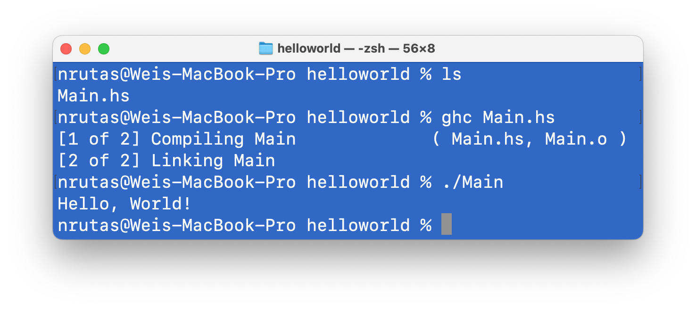
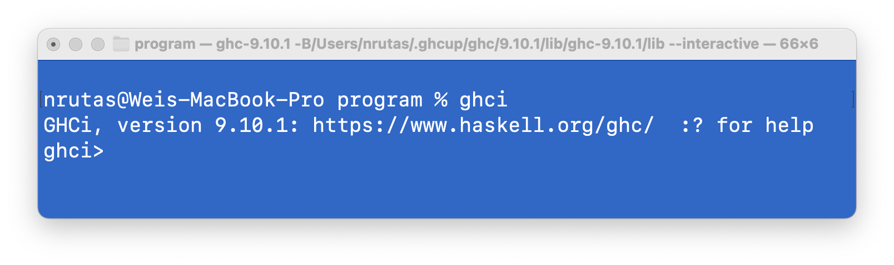
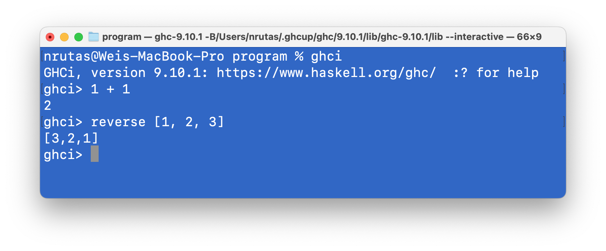

# 第 03 章：初见 Haskell

## 使用 Haskell 语言定义函数

> 在这一节中，我们采用 Haskell 语言，对上一章给出的若干函数示例进行重定义，并结合这些示例对 Haskell 语言的相关细节进行说明。

### 01 逻辑非运算

#### 第 1 种定义方式：模式匹配 (Pattern Matching)

```Haskell
not :: Bool -> Bool
not True  = False
not False = True
```
相关信息说明：

- 你可以在 `https://play.haskell.org/` 这个页面实际运行一下这个程序

  > 在 Haskell 缺省加载的信息中已经存在了`not`函数的定义；\
    为了避免重名导致的编译错误，最简单的调整方式：把函数名改变一下。

  > 尝试在 `https://play.haskell.org/` 中输入如下程序：
  >  ```haskell
  >  main :: IO ()
  >  main = do
  >    putStrLn $ show $ not' True
  >
  >  not' :: Bool -> Bool
  >  not' True  = False
  >  not' False = True
  >  ```
  > 然后点击 “Run” 按钮

- `Bool` 是一个类型；它包含两个值：`True` `False`

- `not :: Bool -> Bool`：声明`not`的类型是`Bool -> Bool`

  > **小和尚：** 为什么不用单个冒号`:`作为类型声明符？
  >
  > **唐僧：** 在Haskell中，单冒号另有它同；
  > - 目前看来，“双冒号作为类型声明符” 这个设计决策并不好

- `not True = False`：把`not True`这个表达式定义为`False`

- `not False = True`：把`not False`这个表达式定义为`True`

上述程序的一种轻微变体：

  ```Haskell
  not :: Bool -> Bool
  not x  = case x of
      True  -> False
      False -> True
  ```

#### 第 2 种定义方式：**条件表达式** (Conditional Expression)

```Haskell
not :: Bool -> Bool
not x = if x == True then False else True
```
相关信息说明：

- 在 Haskell 中，`=` 和 `==` 具有完全不同的含义

  - `=` 表示 **“定义为”**，即：将其左侧的表达式定义为右侧的表达式

  - `==` 是一个 **逻辑运算符**，用来计算左右两侧表达式的值是否相等


#### 第 3 种定义方式：**Guarded Equations**

```Haskell
not :: Bool -> Bool
not x | x == True  = False
      | x == False = True
```
或者，

```Haskell
not :: Bool -> Bool
not x | x         = False
      | otherwise = True
```

### 02 逻辑与运算

#### 第 1 种定义方式：Pattern Matching

```Haskell
and :: Bool -> Bool -> Bool
and True  True  = True
and True  False = False
and False True  = False
and False False = False
```
相关信息说明：

- 在 Haskell 中，运算符 `->` 满足右结合律

  - 也即：`Bool -> Bool -> Bool` 等价于 `Bool -> (Bool -> Bool)`

  > **思考：** `(Bool -> Bool) -> Bool` 这个类型的含义是什么？

#### 第 2 种定义方式：Pattern Matching + Wildcard

```Haskell
and :: Bool -> Bool -> Bool
and True True	= True
and _     _   	= False
```

- 一个单独的下划线 `_` 是一个 wildcard，表示这里有一个值，但我们选择无视它

> <div class="warning">
>
> **作业 01**
>
> 关于逻辑与 (and) 函数，你还能想到其他定义方式吗？\
> 请用 Haskell 语言写出至少其他三种定义方式。
>
> </div>

#### 更传统的一种定义方式

```Haskell
and :: (Bool, Bool) -> Bool
and (True, True) = True
and (_   , _   ) = False
```

### 03 整数的算术运算

#### 算术运算符

在书写算术运算时，通常不会采用函数的形式进行书写，而是采用更为直观的**算术运算符** (Operator)

- 例如，一般不会书写 `plus a b`，而是写为 `a + b`


Haskell 提供了常用的算术运算符：

- `+` 加法运算；`-` 减法运算；`*` 乘法运算；`^` 指数运算


**二元运算符的函数化**

对于两个整数 `x` `y`：

- `x + y` === `(+) x y`

- 也即，`(+)`是一个函数，其类型为 `Integer -> Integer -> Integer`

- `Integer` 是 Haskell 提供的一种整数类型，可以表示任意整数值

在此基础上，Haskell还提供了一种增强语法

- `(x +) y` === `x + y`

- `(+ y) x` === `x + y`

**函数的运算符化**

对于一个函数，也可以将其转换为对应的运算符：

- 例如，`div x y` === `x`&#96;div&#96;`y`

**整数的除运算**

- 如果你需要的是整除运算，使用函数 `div`

- 如果你需要的是带有小数的除运算，使用运算符 `/`


> <div class="warning">
>
> **作业 02**
>
> 请用目前介绍的 Haskell 语言知识，给出函数`div`的一种或多种定义。
> - div :: Integer -> Integer -> Integer
>
> 说明：
>
> - 不用关注效率
>
> - 不用关注第二个参数为 0 的情况
>
> - 如果你认为这个问题无解或很难，请给出必要的说明
>   - 为什么无解？ 或者，困难在哪里？
>
> </div>

### 04 自然数相关的函数

#### 自然数类型

Haskell 标准库的模块`Numeric.Natural`中定义了一种自然数类型`Natural`，可表示任意自然数。\
但这个类型缺省没有被加载到程序中。

为了在程序中使用这个类型，我们需要在程序文件的开始添加如下语句：

```haskell
import Numeric.Natural (Natural)
```
- 含义：把`Numeric.Natural`模块中的元素`Natural`引入到当前程序文件中

#### 阶乘函数

```haskell
fact :: Natural -> Natural
fact 0 = 1
fact n = n * fact (n - 1)
```
- 这是一个采用 pattern matching 进行定义的函数，含义如下：

  - 对于一个自然数`n`：
    - 如果 `n == 0`，则将 `fact n` 定义为 `1`
    - 否则，将 `fact n` 定义为 `n * fact (n - 1)`

- 在程序运行过程中，如果要评估表达式`fact x`的值，则会按照定义中给出的顺序进行模式匹配。

  具体而言：

  - 首先检查`x`是否可以匹配到`0`上：若匹配成功，则将`fact x`评估为`0`；否则，继续匹配。

  - 继续检查`x`是否可以匹配到通配符`n`上。\
    因为：`n`是通配符，可以匹配到任何自然数上。\
    所以：这次匹配一定成功，从而将`fact x`评估为`x * fact (x - 1)`

- 在 Haskell 中，函数应用 (Function Application) 具有最高优先级
  - 因此：`x * fact (x - 1)` 等价于 `x * (fact (x - 1))`

> <div class="warning">
>
> **作业 03**
>
> 关于阶乘函数，你还能想到其他定义方式吗？\
> 请分别使用 “guarded equations” 和 “conditional expression” 写出阶乘函数的定义。
>
> </div>


#### 自然数上的 fold 函数

```haskell
fold :: (t -> t) -> t -> Natural -> t
fold h c 0 = c
fold h c n = h (fold h c (n - 1))
```
说明：

- 在`fold`的类型中，小写字母 `t` 表示一个 **类型变量**，`Natural` 表示一个具体的类型

> **小和尚：**
> - 如何确定函数类型声明中出现的名称，是一个具体类型，还是一个类型变量呢？
>
> **唐僧：**
> - 对于该问题，Haskell 在语法层次上给出了一种简单有效的解决方案：
>   - 如果名称的 首字符 是 小写字母，则表示 **类型变量**
>   - 如果名称的 首字符 是 大写字母，则表示 **具体类型**

- 表达式 `h (fold h c (n - 1))` 中出现的圆括号

  不是：主流编程语言 (C/C++/Java/Rust) 中函数调用时用于传参的圆括号

  而是：用于 **调整运算顺序** 的圆括号。

  - 如果不加这些括号，则 `h fold h c n - 1` === `((((h fold) h) c) n) - 1`

- 在 Haskell 中：

  - 函数调用具有最高优先级。因此，肯定比运算符的优先级高

  - 函数调用满足左结合律。因此，`f g h k` === `((f g) h) k`

- 如果你对这种调整运算顺序的括号很反感，Haskell 提供了另一种解决方案：

  > 二元运算符: `$`

  - 该运算符：**1. 具有最低优先级**；**2. 满足右结合律**

  - 运算效果：把左侧的函数 应用到 右侧的元素上

  因此，如下三个表达式等价：

  ```haskell
  h  (fold h c  (n - 1))
  h $ fold h c  (n - 1)
  h $ fold h c $ n - 1
  ```

#### 阶乘函数 (fold版本)

```haskell
fact :: Natural -> Natural
fact = snd . (fold f (0, 1))

fst :: (a, b) -> a
fst (x, _) = x

snd :: (a, b) -> b
snd (_, y) = y

f :: (Natural, Natural) -> (Natural, Natural)
f (m, n) = (m + 1, (m + 1) * n)
```
说明：

- dot运算符`.`实现 **函数组合** 的功能

  - `f (g x)` === `(f . g) x` === `f . g $ x`

  - `f . g x` === `f . (g x)`

#### 斐波那契函数 (fold版本)

```haskell
fib :: Natural -> Natural
fib = fst . (fold g (0, 1))

g :: (Natural, Natural) -> (Natural, Natural)
g (m, n) = (n, m + n)
```

### 05 序列相关的函数

#### Haskell 中的序列类型

对于任意类型 `a`，其对应的序列类型，可以书写为 `[a]`。

序列值的表示方式 (以`[Natural]`为例)：

- 空序列：`[]`

- 包含一个自然数`1`的序列：`[1]` 或 `1 : []`
  -  这里出现的单冒号`:`是一个二元运算符

- 包含三个自然数`1` `2` `3`的序列：`[1, 2, 3]` 或 `1 : 2 : 3 : []`
  - 可知：二元运算符`:`满足右结合律

#### 序列上的 fold 函数

```haskell
foldr :: (a -> b -> b) -> b -> [a] -> b
foldr h c [] = c
foldr h c (x:xs) = h x (foldr h c xs)

foldl :: (b -> a -> b) -> b -> [a] -> b
foldl h c [] = c
foldl h c (x:xs) = foldl h (h c x) xs
```

#### 序列上的若干函数

```haskell
len :: [a] -> Natural
len [] = 0
len (n:ns) = 1 + len ns
```

<table>
<thead><tr>
  <th>原始递归版本</th>
  <th>fold函数版本</th>
</tr></thead>
<tbody>

<tr>
  <td>

  ```haskell
  len :: [a] -> Natural
  len [] = 0
  len (n:ns) = 1 + len ns
  ```
  </td>
  <td>

  ```haskell
  len :: [a] -> Natural
  len = foldr h 0 where
      h x n = n + 1
  ```
  </td>
</tr>

<tr>
  <td>

  ```haskell
  concat :: [a] -> [a] -> [a]
  concat [] ns = ns
  concat (m:ms) ns = m : concat ms ns
  ```
  </td>
  <td>

  ```haskell
  concat :: [a] -> [a] -> [a]
  concat xs ys = foldr (:) ys xs
  ```
  </td>
</tr>

<tr>
  <td>

  ```haskell
  filter :: (a -> Bool) -> [a] -> [a]
  filter p [] = []
  filter p (n:ns)
      | p n   =  n : filter p ns
      | otherwise =  filter p ns
  ```
  </td>
  <td>

  ```haskell
  filter :: (a -> Bool) -> [a] -> [a]
  filter p = foldr (k p) [] where
   -- k :: (a -> Bool) -> a -> [a] -> [a]
      k p n ns | p n   = n : ns
               | otherwise = ns
  ```
  </td>
</tr>

<tr>
  <td>

  ```haskell
  rev :: [a] -> [a]
  rev = revm [] where
   -- revm :: [a] -> [a] -> [a]
      revm xs [] = xs
      revm xs (y:ys) = revm (y:xs) ys
  ```
  </td>
  <td>

  ```haskell
  rev :: [a] -> [a]
  rev = foldl (flip (:)) []
  ```
  </td>
</tr>

</tbody>
</table>

### 06 一种快速排序算法

```haskell
qsort :: [Integer] -> [Integer]
qsort []     = []
qsort (n:ns) = (qsort $ filter (< n) ns) ++ [n] ++ (qsort $ filter (>= n) ns)
```

> **思考：** 猜一猜，二元运算符 `++` 的功能是什么？

Haskell还提供了一些语法机制，可以让qsort的定义更加结构化。

#### let ... in ... 表达式

```haskell
qsort :: [Integer] -> [Integer]
qsort [] = []
qsort (n:ns) = let smaller = qsort $ filter (<  n) ns
                   larger  = qsort $ filter (>= n) ns
               in smaller ++ [n] ++ larger
```
- 在 `in` 后面的这个表达式中，可以访问 `let ... in` 之间定义的变量


#### where 子句

```haskell
qsort :: [Integer] -> [Integer]
qsort []     = []
qsort (n:ns) = smaller ++ [n] ++ larger
    where
        smaller = qsort $ filter (<  n) ns
        larger  = qsort $ filter (>= n) ns
```

> **`let-in 表达式` 与 `where 子句` 的 区别：**
>
> - 在大部分情况下，两者没有本质的区别，仅仅反映了不同的表现形式
>
> - 在一些情况下，`where 子句`定义的变量具有更大的作用范围
>   ```haskell
>   f x y | cond1 x y = g z
>         | cond2 x y = h z
>         | otherwise = k z
>       where z = p x y
>   ```
>   - 在`where 子句`中定义的一个变量`z`，可在 guarded equations 的任何地方访问
>
>   - `let in 表达式`不具有这样的能力
>

<br>

> **唐僧：**
>
> - 你的感觉如何？
>
>   我们用了一些朝三暮四的把戏 (规定一些语法规则)，\
>   把函数式思维的形式变得更容易理解了。
>
> **小和尚：**
>
> - 我再观察一下；
>
>   如果你继续搞这些朝三暮四的小把戏，我就准备退课了！
>

## Haskell 中标识符和运算符的命名规则

### 元素命名

在很多情况下，我们需要为程序中定义的元素 **命名**

- 所谓 “命名”，就是给一个东西赋予一个具有区分作用的名称

- 名称的作用：可以通过名称引用到所指向的那个程序元素

Haskell 中的名称，分为两大类：

1. **标识符** (Identifier)

2. **运算符** (Operator Symbol)

### 01 标识符的命名规则

1. 由一或多个字符顺序构成

2. 首字符只能是一个字母 (letter)，具体包括：
   - ASCII 编码表中的所有字母 (即：所有英文大小写字母)
   - Unicode字符集中的所有字母

3. 其他字符只能是 `字母` / `数字` / `英文下划线` / `英文单引号`

4. 不能与 Haskell 的保留词重名
   - `case` `class` `data` `default` `deriving` `do` `else` `foreign` `if` `import` `in` `infix` `infixl` `infixr` `instance` `let` `module` `newtype` `of` `then` `type` `where` `_`

5. 根据程序元素的不同，Haskell 还对标识符的首字符进行了进一步的限制
   - 一些程序元素，其 标识符的首字符 只能是 大写字母
   - 其他程序元素，其 标识符的首字符 只能是 小写字母

     > 目前已经涉及到的程序元素包括：
     > - 函数 / 变量 / 类型变量：名称首字符必须是小写字母
     >
     > - 类型：名称首字符必须是大写字母

### 02 运算符的命名规则

1. 由一或多个符号 (symbol) 顺序构成，具体包括：
   - ASCII 编码表中的所有符号：`!` `#` `$` `%` `&` `*` `+` `.` `/` `<` `=` `>` `?` `@` `\` `^` `|` `-` `~` `:`
   - Unicode 字符集中的大部分符号

2. 不能与Haskell的保留运算符重名
   - `..` `:` `::` `=` `\` `|` `<-` `->` `@` `~` `=>`

3. Haskell进一步将运算符分为两类：(1) 以英文冒号`:`为首字符的运算符；(2) 其他运算符
   - 更多信息，按需说明

## Hello, World!

### 01 Haskell 中的 Hello, World!

```haskell
main = do
  putStrLn "Hello, World!"
```
说明：

- 这是一个合法的 Haskell 程序 (符合 Haskell 语言规范)

- 它隐藏了一些代码，以至于看起来有些奇怪

- 恢复这些代码后，会得到一个更完整的程序：

```haskell
module Main(main) where
import Prelude

main :: IO ()
main = do
  putStrLn "Hello, World!"
```
- `module Main(main) where`：

  - 这个文件定义了一个模块 `Main`
  - 这个模块对外输出了一个名称为 `main` 的元素
  - 这个模块中定义的元素出现在`where`之后

> **Haskell 中的模块**
>
> 关于模块 (Module)，Haskell 语言规范中给出了如下信息：
>
> 1. 一个 Haskell 程序由一或多个模块构成，且每一个模块定义在一个单独的文件中
>
> 2. 一个 Haskell 程序必须包含一个名为`Main`的模块
>
>    - `main`元素的类型必须是 `IO t`；其中，需要把 `t` 替换为一个具体的类型
>
>    - `IO` 是`Prelude`模块对外输出的一个元素，用于封装 IO 运算
>
>      - `Prelude`模块对外输出的所有元素都会被默认加载到任何一个模块中
>
>    - 一个 Haskell 程序的运行就是对`Main`模块中的`main`元素进行求值的过程。\
>      而且，最终获得的值会被抛弃。
>
> 3. 模块的名称必须满足如下两个条件之一
>
>    - 一个以大写字母开头的标识符。
>      - 例如：`MyModule`
>
>    - 两或多个以大写字母开头的标识符，通过字符`.`连接在一起。
>      - 例如：`This.Is.Mymodule`
>
> 4. 如果：一个模块在设计时就已经确定不会被其他模块所引用\
>    那么：该模块可以放在任意一个具有合法名称的文件中
>
>    - 通常，`Main`模块不会被其他模块所引用\
>      因此，可以把`Main`模块放在任意一个文件中
>
>    - 但是，将`Main`模块所在文件名设定为`Main`，不失为一个好选择
>
> 5. 如果：一个模块可能会被其他模块所引用，\
>    那么：该模块所在的文件必须满足如下条件：
>
>    - 如果：模块名是一个标识符，那么：模块所在文件的名称必须与模块名相同
>
>    - 如果：模块名是多个标识符通过`.`字符连接在一起，那么：
>
>      - 模块所在文件的名称必须与模块名中最后的标识符相同
>        - 例如，模块`This.Is.Mymodule`\
>          必须放置在一个名为`Mymodule`的文件中
>          - 这里的文件名，不包含文件扩展名
>
>      - 模块名中前面的每一个标识符及其之间的顺序关系，\
>        必须与文件系统的目录名以及目录之间的包含关系存在一一对应
>        - 例如，模块`This.Is.Mymodule`\
           必须放置在源文件目录下的`This/Is/Mymodule`这个文件中。

- `import Prelude`

  - 把`Prelude`模块对外输出的所有程序元素加载到当前模块中

  - Haskell 规定：

    - 若模块源码中不存在`import Prelude`声明，则表明其缺省存在
      - 效果：你在程序中可以直接使用`Prelude`输出的所有元素

    - 若模块源码中存在`import Prelude`或其变体，则从`Prelude`中按需加载元素
      - 例如：如果模块中存在`import Prelude(Integer, (+), (-))`\
        则表明只需把`Prelude`对外输出的`类型Integer`、`加运算符`、`减运算符`三个元素加载到当前模块中；Prelude对外输出的其他元素无需加载

      - 例如：下面的 Haskell 模块定义不合法

        ```haskell
        module Main(main) where
        import Prelude(Integer, (+), (-))

        main :: IO ()
        main = do
          putStrLn "Hello, World!"
        ```
        原因：该模块中出现了两个未定义的元素 `IO` `putStrLn`

- `main :: IO ()`

  - `main`元素的类型是 `IO ()`

    - `()` 是一个类型，称为 `0 元组` (0-tuple) 类型

    - `IO` 是一个类型构造器 (type constructor)

    - `IO ()` 是一个类型，其中封装了 IO 运算，且该运算会返回一个 0 元组

    > **小和尚：**
    >
    > - 为什么`main`的类型不是函数呢？
    >
    >   C/C++/Java/Rust语言的main都是函数。
    >
    > **唐僧：**
    >
    > - 因为`main`本来就不是函数。
    >
    >   你在哪本数学书上见到过`main`这样的函数？
    >
    >   哪有函数一言不合就向控制台输出字符串的呢？
    >
    > **小和尚：**
    >
    > - 既然如此，C/C++等语言为什么把main作为函数呢?
    >
    > **唐僧：**
    >
    > - 我想，它们大概是为了让自己显得很 NB。
    >
    >   任何东西，能和数学沾上关系，就会显得高大上了
    >
    >   例如，有的公司举办了全球数学竞赛，又不公布成绩，...

- `main = do`\
  &nbsp;&nbsp;`putStrLn "Hello, World!"`

  - 定义了`main`中封装的 IO 运算

  - 这个 IO 运算中仅包含了一个 IO action，即：在控制台输出一串字符

  - 如果你愿意，可以继续添加一个IO action:\
    `putStrLn "Hello, World! AGAIN"`
    - 注意：应保持与上一行相同的缩进

  > **小和尚：** `do`是什么梗？
  >
  > **唐僧：** 一言难尽啊！
  >
  > - 简而言之：`do`是一种语法糖 (syntax sugar)
  >   - 在函数的世界里，没有“顺序执行”这个概念 (这句话其实有些含糊)
  >   - 但是，可以用一些机制去仿真“顺序执行”
  >   - `do`的作用就是把这些机制封装起来，让程序具有更好的易理解性

- `putStrLn "Hello, World!"`

  - `putStrLn`是`Prelude`模块输出的一个程序元素，定义如下：

     ```haskell
     putStrLn :: String -> IO ()
     putStrLn s = do putStr s
                     putStr "\n"
     ```

### 02 一个具有更多交互性的程序

```haskell
module Main(main) where
import Prelude

main :: IO()
main = do
  putStrLn "Please input your name:"
  name <- getLine
  putStrLn $ "Hello, " ++ name
  putStrLn "Please input an integer:"
  str1 <- getLine
  putStrLn "Please input another integer:"
  str2 <- getLine
  let int1 = (read str1 :: Integer)
  let int2 = (read str2 :: Integer)
  putStrLn $ str1 ++ " + " ++ str2 ++ " = " ++ (show $ int1 + int2)
```
- `name <- getLine`

  `getLine`是`Prelude`模块输出的一个元素，其定义如下：

  ```haskell
  getLine :: IO String
  getLine = do c <- getChar
               if c == '\n' then return "" else
                   do s <- getLine
                      return (c:s)
  ```

  符号`<-`是与`do`绑定的一种语法。

  在这行代码中，`<-`的效果，暂时可以做如下理解：
  - 把`getLine`返回的`IO String`类型的值中的那个`String`类型的值赋给`name`

- `let int1 = (read str1 :: Integer)`

  这一行代码看来既熟悉又陌生：
  - 我们看到了熟悉的`let`，却没有看到它的好伙伴`in`
  - 这个`let`就是`let in`中的`let`，用于定义在后面被使用的变量；\
    但是，`in`被语法糖隐藏了 (时机合适时，再介绍细节)

  `read str1 :: Integer`
  - `read`是`Prelude`输出的一个函数，其类型大约是`String -> a`
  - 这个表达式的效果：把一个字符串转换为一个整数值
  - 在调用`read`时，若无法从上下文中推断出`a`对应的具体类型，\
    则需在其后面放置 `:: X`，显式说明`a`的具体类型为`X`

- `show $ int1 + int2`
  - `show`是`Prelude`输出的一个函数，其类型大约是`a -> String`
  - `show`的功能：把一个值转换为一个字符串

> **唐僧：**
> - 掌握了Haskell 语言IO相关的操作，再加上前面介绍的知识，你应该可以做很多事情了
> - 非常遗憾的是，这些程序目前还不能运行
> - 不用太担心，想让程序运行，分分钟的事
>
> **小和尚：**
> - 分分钟是多久呢？
>
> **唐僧：** 😅 ... (画外音：气氛突然有些尴尬)

## Haskell程序的编译、运行、管理

> - 当你用自然语言写了一本小说，可以把它发表在互联网上；\
>   然后，读者们就可以阅读这本小说了
>
> - 当你用 Haskell 语言写了一个程序，也可以把它发表在互联网的某个代码托管网站上；\
>   然后，程序员们就可以阅读这个程序了
>
> - 与小说不同的是，程序还有另外一类读者：**计算机**
>   - 计算机需要理解程序，并在各类硬件和软件资源的支持下，执行程序所表达的计算过程
>
> - 对于程序设计语言的发明者们而言，定义语言的语法形式，仅仅是万里长征的第一步
>
> - 为了让程序能够在硬件上运行，还需提供一系列软件支撑工具
>
> - 这些工具又被称为程序设计语言的 **工具链** (toolchain)

在本节中，我们主要介绍 Haskell 语言工具链中的三个基本工具：
1. GHC (Glasgow Haskell Compiler)：
   - 一种得到广泛使用的Haskell语言编译器，\
     能够把合法的Haskell程序变换计算机可执行的机器指令序列

2. GHCi：
   - Haskell程序的一种交互式 (interactive) 运行环境；\
     程序员可在其中输入任意合法的表达式，然后 GHCi 对表达式进行求值，并输出结果

3. Stack：
   - 一种常用的 Haskell 软件项目构建管理工具

### 00 Haskell 工具链的安装

进入页面 `https://www.haskell.org/ghcup/`。

按照说明，在自己的计算机上安装 Haskell 工具链。
- 安装过程中总会遇到各种问题
- 遇到问题，莫慌张，主动寻求助教或其他同学的帮助


### 01 GHC 的使用

> ghc 是 Haskell 语言的一种编译器 (compiler)\
> 作用：把一个合法的 Haskell 程序转换/编译为在当前计算机上可运行的二进制程序

**Step 1：** 把下面的程序代码放置到某个文件夹下的`Main.hs`文件中

```haskell
-- This is my first Haskell program
module Main(main) where
import Prelude

main :: IO ()
main = do
  putStrLn "Hello, World!"
```
- 第一行为程序 **注释** (comment)

  -   注释就是对程序做的一些说明，不会改变程序的运行时行为

- Haskell 的注释分为两类：

  1. **单行注释：** 以两个连续连字符 `--` 开始的一行文字

  2. **多行注释：** 以 `{-` 开始、以 `-}` 结束的所有文字

**Step 2：** 打开终端 (Terminal) 应用，把当前目录设置为`Main.hs`所在的文件夹

**Step 3：** 编译程序 (即：在终端中输入命令`ghc Main.hs`，并回车)

**Step 4：** 运行程序 (即：在终端中输入命令`./Main`，并回车)



> - 对于第一次接触程序设计语言的同学，这是一个具有历史意义的时刻。
>
>   **这是人类的一大步，却只是个体的一小步。**
>
> - 许多年之后，面对未名湖边随风摇曳的垂柳，\
>   你将会回想起，费尽千辛万苦终于成功运行这个无聊程序的那个遥远的夜晚。

> **动手练一练 01**
>
> 请把前文介绍的那个更有交互性的 Haskell 程序，用 ghc 命令编译为可执行程序。\
> 然后运行该程序，观察程序和你的交互过程。

关于 ghc 的详细使用说明，可访问其官方网站：https://www.haskell.org/ghc/
- 没事不要打开这个链接；打开了也看不懂。\
  你需要在学习过编译原理相关的知识后，再来看一看。


### 02 GHCi 的使用

> ghci 是 Haskell 程序的一种交互式运行环境。\
> ghci 默认加载`Prelude`模块；因此，可直接使用该模块输出的元素



你可以在其中输出合法的 Haskell 表达式；ghci 会输出求值结果。



ghci 中的常用命令：

- `:?`   列出ghci支持的所有命令

- `:quit` 或 `:q`   退出当前ghci环境

- `:load <模块文件名>`   把一个指定的模块加载到当前环境中

- `:reload`	  重新加载那些已经加载的模块 (这些模块可能被修改了)

> **`:load` 命令使用示例：**
>  - 打开终端 (Terminal) 应用，把当前目录设置为`Main.hs`所在的文件夹
>
>  

> **动手练一练 02**
>
> 1. 把前文介绍的快速排序函数`qsort`封装在一个 Haskell 模块中；
> 2. 在 ghci 中加载这个模块；
> 3. 在 ghci 中对`qsort`函数的正确性进行测试
>    - 即：把这个函数作用到若干序列数据上，观察函数的返回值是否符合预期
>

### 03 Stack 的使用

> stack 是一种面向 Haskell 程序开发的构建管理工具。\
> 其管理内容覆盖：代码组织方式、编译器版本及编译参数、外部依赖关系、测试等。

ghc、ghci 适合做一些小打小闹的事情：
- 例如，学习 Haskell 语言、编写一个小规模的 Haskell 程序等
- 其中，ghci 可以作为一种入门级的程序调试环境

真实的软件开发是一种面向群体的智力密集型活动。

> **小和尚：**
> - 我就一个人开发一个复杂的软件应用，不可以吗？
>
> **唐僧：**
> - 可以，一个建筑工人也可以独立建造一栋摩天大楼；只要给他足够的时间。
>
> - 群体软件开发还面临各种复杂的管理问题
>   - 包括：人力资源管理、需求管理、软件制品管理、编译环境管理、开发进度管理等
>
> - **工欲善其事，必先利其器**：需要采用合适的工具应对这些问题

下面，我们基于stack 的官方使用说明，对它进行简要的介绍。

**`stack new` 命令**

- 使用`stack new`命令，可以创建一个具有特定名称的软件开发项目，其中包含一个**包**(package)
- Package这个概念在语言规范中并不存在，但在实践中得到广泛应用。

  在逻辑上，一个 package 包含若干相关的 Haskell 模块。
  - 例如：可以把一个完整的Haskell程序打包为一个package，其中包含一个Main模块、若干个被Main模块加载的自定义模块、以及相关的测试模块。

- 一个 package 具有一个全局唯一的名称

  - package 的名称由若干个单词通过连字符`-`连结在一起
  - 每个单词由若干字母或数字组成，且至少包含一个字母

如果要在一个特定的文件夹下创建一个名称为`foo`的项目，可以这么做：
1. 打开终端应用，将当前目录设定为项目所在的文件夹
2. 运行如下命令 (确保你的计算机处于联网状态)

   `stack new foo`

如果一切顺利，当前文件夹下会存在一个名为`foo`的文件夹
- `foo`项目的所有信息都被放在这个文件夹中

使用`cd foo`命令进入这个文件夹，可以看到其中存在的信息：

> ```shell
> .
> ├── CHANGELOG.md
> ├── LICENSE
> ├── README.md
> ├── Setup.hs
> ├── app
> │   └── Main.hs
> ├── foo.cabal
> ├── package.yaml
> ├── src
> │   └── Lib.hs
> ├── stack.yaml
> ├── stack.yaml.lock
> └── test
>     └── Spec.hs
> ```

**`stack build` 命令**

- 在终端的`foo`目录下输入命令`stack build`对`foo`项目进行构建

**`stack exec` 命令**

- 在终端的`foo`目录下输入命令`stack exec foo-exe`，运行当前项目

  - 如果你觉得`foo-exe`这个名字不好，可以在配置文件中修改成另外一个

**`stack test` 命令**

- 在终端的`foo`目录下输入命令`stack test`，可以触发对当前项目的测试

  - stack 已经帮助我们建立了一个空的测试程序

  - 我们需要根据项目的实际内容向其中填写相应的测试代码

    - 例如，如果你自己编写了一个排序函数，为了确保功能的正确性，你需要在若干种具有代表性的数据上测试排序函数的输出是否符合你的预期。

    - 只要把这些测试数据按照规定的方式写在特定的文件中，`stack test`命令就会自动执行对应的测试活动，并给出测试结果.

#### stack 在`foo`项目中创建的文件

- **三个文件：** `LICENSE` / `README.md` / `CHANGELOG.md`

  1. `LICENSE`   声明当前项目版权相关的信息

  2. `README.md`   对当前项目的简要说明、

  3. `CHANGELOG.md`   记录项目在不同版本中发生的变更情况

  - 这三个文件不会参与到编译活动中，不会对构建过程产生影响

- **两个文件：** `helloworld.cabal` / `Setup.hs`

  - 这是更底层的构建工具`cabal`相关的两个文件；无需关注

- **一个文件：** `stack.yaml`。其中记录了两条信息：

  ```yaml
  packages:
  - .
  ```
  - 含义：当前项目中包含一个 package，它就存在于`stack.yaml`所在的文件夹中

  ```yaml
  snapshot:
    url: https://raw.githubusercontent.com/commercialhaskell/stackage-snapshots/master/lts/24/4.yaml
  ```
  - 含义：一个 URL，指向互联网上的一个 yaml 文件，其中指明了当前项目使用的 GHC 版本以及一些可用的外部 package

- **一个文件：** `package.yaml`

  ```yaml
  name:                foo
  version:             0.1.0.0
  github:              "githubuser/foo"
  license:             BSD-3-Clause
  author:              "Author name here"
  maintainer:          "example@example.com"
  copyright:           "2025 Author name here"

  extra-source-files:
  - README.md
  - CHANGELOG.md

  # Metadata used when publishing your package
  # synopsis:            Short description of your package
  # category:            Web

  # To avoid duplicated efforts in documentation and dealing with the
  # complications of embedding Haddock markup inside cabal files, it is
  # common to point users to the README.md file.
  description:         Please see the README on GitHub at <https://github.com/githubuser/foo#readme>

  dependencies:
  - base >= 4.7 && < 5

  ghc-options:
  - -Wall
  - -Wcompat
  - -Widentities
  - -Wincomplete-record-updates
  - -Wincomplete-uni-patterns
  - -Wmissing-export-lists
  - -Wmissing-home-modules
  - -Wpartial-fields
  - -Wredundant-constraints

  library:
    source-dirs: src    # 当前项目的 lib 文件放在 src 文件夹中

  executables:
    foo-exe:    # stack exec 命令后跟的那个名字；可以被修改为其他名称
      main:                Main.hs    # main 元素定义在 Main.hs 中
      source-dirs:         app        # foo-exe 的源文件放在 app 文件夹中
      ghc-options:
      - -threaded
      - -rtsopts
      - -with-rtsopts=-N
      dependencies:
      - foo

  tests:
    foo-test:
      main:                Spec.hs
      source-dirs:         test
      ghc-options:
      - -threaded
      - -rtsopts
      - -with-rtsopts=-N
      dependencies:
      - foo
  ```

- **三个 hs 文件：**

  1. `app/Main.hs`

     ```haskell
     module Main (main) where

     import Lib

     main :: IO ()
     main = someFunc
     ```
  2. `src/Lib.hs`

     ```haskell
     module Lib
         ( someFunc
         ) where

     someFunc :: IO ()
     someFunc = putStrLn "someFunc"
     ```
  3. `test/Spec.hs`

     ```haskell
     main :: IO ()
     main = putStrLn "Test suite not yet implemented"
     ```

> **唐僧：** 我想，你大概明白`stack new foo`做了什么吧？
>
> - 它帮我们创建了一个 Haskell 程序的骨架以及编译和运行环境。
>
>   - 所有的这一切，stack 都进行了很好的封装，使得我们只需要使用stack提供的几个命令，就能对一个软件开发项目进行便捷的管理

> **动手练一练 03**
>
> 请使用stack 创建一个名为qsort 的项目。然后：
> 1. 在`src/Lib.hs`中添加并输出前面介绍的`qsort`函数；
> 2. 在`app/Main.hs`中加载`Lib`模块，\
>    然后，找几个待排序的数据，用`qsort`函数对它们进行排序，打印出排序的结果

#### 基于 stack 的 package 管理

- 有人说，他站在了巨人的肩膀上，看到了很远的地方

  此言确实不虚，在软件开发中也是如此

- 在真实的软件开发项目中，很少有开发者从零开始编写所有的软件代码

  开发者总是尽可能复用其他开发者已经开发完成的功能模块。

  - 例如，前面我们看到的`Prelude`模块就是 Haskell 标准库提供的一个模块。
  - Haskell 标准库还提供了很多其他模块；具体参见Haskell语言规范
  - Haskell 也提供了 import 语句来支持对其他模块的复用

- 但是，事情并没有到此结束

- **软件开发者群体是一个乐于分享的群体**

  - 有很多程序员耗费了大量的精力，开发出很多高质量的软件模块，然后把这些模块放在互联网，供其他开发者免费使用

  - 然后，其他开发者在前人开发的模块的基础上又开发出新的模块，并共享到开发者群体中

  - 长此以往，就形成了一种欣欣向荣的生态系统

  - 在这个生态系统中，丰富多样的软件模块不断涌现，持续演化，就像自然界生态系统所展现出的物种的多样性和持续演化那样

- 这种乐于分享的特点在 Haskell 开发者群体中也是存在的，也在此基础上形成了欣欣向荣的生态

- 在这个生态系统中，开发者分享工作成果的基本单位是 **package**，
  - 也即：一个开发者把一组相关的Haskell模块封装为一个package，然后将其发布到互联网上

> **小和尚：**
> - 分享工作成果的基本单位什么不能是模块呢？
>
> **唐僧：**
> - 其实，你把一个模块单独封装为一个package也是可以的
>
> - 在更一般的意义上，不以模块作基本发布单位的主要原因如下：
>   1. 模块不存在版本的概念
>      - 在软件开发生态系统中，演化是一种常态
>      - 缺失了版本的概念，使得我们不能对同一个模块的不同版本进行有效管理
>
>   2. 在很多场景下，模块过于细粒度
>      - 如果要对外发布一个复杂的Haskell应用程序，以模块为基本单元显然不合适
>
>   3. 当你对外发布一个模块时，为了使得其他开发者对该模块的质量具有足够的信心，你可能还需要将该模块的测试数据和程序一起对外发布。此时，将一个模块以及附带的测试模块打包一个 package，具合理性.

- 使用`stack new`创建的项目，其中就包含了一或多个 package

  - 这些 package 的信息记录在`stack.yaml`文件的`packages`配置项中
  - 例如，在`foo`项目中，packages 下面只包含一个值，即：点符号 `.`
    - 这表明，在`foo`项目的根目录中存在一个 package

- 在 stack 项目中，每一个 package 的管理信息记录在一个名为`package.yaml`的文件中.

  - 该文件包含一个重要的配置项 **`dependencies`**

    - 它记录了当前 package 依赖的所有其他 package 的名称与版本信息

    - 例如，在`foo`项目包含的唯一一个 package 的`package.yaml`文件中，配置项 `dependencies` 信息如下：

      ```yaml
      dependencies:
      - base >= 4.7 && < 5
      ```
      - 含义：当前 package 依赖于一个名称为`base`的 package，且要求`base`的版本号落在区间［4.7, 5）中

      > 一个重要问题：**如何获得这个名称为base的特定版本的 package 呢？**

- Haskell 社区维护了一个在线的 package 仓库，并将其命名为 Hackage

  `https://hackage.haskell.org/`

  任何一个开发者都可以向这个仓库中发布自己开发的 package，也可以从这个仓库中下载特定名称和特定版本的 package

- 你可以在 Hackage 中搜索名称为`base`的 package

  在结果页面上，可以看到`base`的所有版本，和每一版本包含的所有模块

  在长长的模块列表中，会看到两个熟悉的名字：`Prelude`和`Numeric.Natural`

  - 因为`base`包含了这两个模块，且当前的项目依赖于`base`，所以，在当前项目中，就可以使用 `import`语句加载这两个模块了

- 你可以在`package.yaml`文件的`dependencies`配置项中添加更多的 package 名称以及对应的版本需求

  然后，使用`stack build`命令，stack 就会自动到 Hackage 仓库中下载对应 package

  如果你不相信，就试试下面的练习吧

> **动手练一练 04**
>
> Hackage 中有一个名称为`random`的 package：
> - 其中包含一个名称为`system.Random`的模块；其中定义了一个名称`randomIO`的元素。
>
> 在 do 后面的代码块中，使用`rnd <- randomIO :: IO Int`，就能得到一个随机生成的整数。
>
>
> 请完成如下事情：
>
> 1. 使用 stack 创建一个名称为`random-num`的项目
>
> 2. 在 package.yaml 文件的`dependencies`下添加一个值：`random == 1.2.0`
>    - 含义：当前 package 依赖一个名称`random`、版本`1.2.0`的 package
>    - 在Mac的M系列芯片上，可能需要把这个值修改为 `random >= 1.2 && < 2`
>
> 3. 在当前项目中实现 “向终端打印出一个随机数” 的功能
>
> 请特别注意，**当你使用`stack new`命令后，终端的输出信息**。

- 需要指出的是，在主流的程序设计语言开发社区中，都存在类似的package管理方式

  - 即：一个被开发者广泛认同的 package 仓库、一个配套的构建管理工具。

    - 这是在互联网时代形成的一种群体软件开发模式，可能会陪伴你很长的时间。
    - 选择一个开发者社区，选择一个有价值的软件开发项目，努力成为项目的核心贡献者，你会收获很多很多。

- 关于 stack，暂且讲到这里吧。有兴趣的同学可自行阅读相关材料

## Haskell 程序的书写

### Haskell 程序的 “书写风格”

对于学习过C / C++ / Java语言的同学而言，可能会觉得Haskell程序的书写有些奇怪

- 在传统语言中，源程序中会出现大量的分号 `;` 和花括号对 `｛ ... ｝`

  - 前者的作用：作为一条语句的终结符
  - 后者的作用：把几条语句封装为一个代码块 (Code Block)

- 但是，在前面出现的 Haskell 程序中，从来没有看到过花括号和分号。

其实，**你误解 Haskell 了**。

- Haskell 规定，在 `where` / `let` / `do` / `of` 这四个关键词后，需要放置一个代码块

- 在代码块的书写上，Haskell提供了两种书写风格：

  1. **Layout-sensitive** (排布无关)

     - 利用代码行的缩进表示语句的结束或代码块的结束

  2. **Layout-insensitive** (排布相关)

     - 利用分号表示语句的结束，利用一对花括号形成一个代码块

- 下面是前文出现的一个采用 layout-sensitive 风格书写的源程序

  ```haskell
  module Main(main) where
  import Prelude

  main :: IO()
  main = do
    putStrLn "Please input your name:"
    name <- getLine
    putStrLn $ "Hello, " ++ name
    putStrLn "Please input an integer:"
    str1 <- getLine
    putStrLn "Please input another integer:"
    str2 <- getLine
    let int1 = (read str1 :: Integer)
    let int2 = (read str2 :: Integer)
    putStrLn $ str1 ++ " + " ++ str2 ++ " = " ++ (show $ int1 + int2)
  ```
  对应的 layout-insensitive 程序如下：

  ```haskell
  module Main(main) where {
    import Prelude;

    main :: IO();
    main = do {
      putStrLn "Please input your name:";
      name <- getLine;
      putStrLn $ "Hello, " ++ name;
      putStrLn "Please input an integer:";
      str1 <- getLine;
      putStrLn "Please input another integer:";
      str2 <- getLine;
      let { int1 = (read str1 :: Integer); };
      let { int2 = (read str2 :: Integer); };
      putStrLn $ str1 ++ " + " ++ str2 ++ " = " ++ (show $ int1 + int2);
    }
  }
  ```

  > **唐僧：**
  > - 你更喜欢哪一种风格呢？
  > - 由繁入简易，由简返繁难；回不去咯！
  >
  > **小和尚：**
  > - 在采用 layout-sensitive 风格书写程序时，如何确定一行代码的缩进长度？
  >
  > **唐僧：** 记住三条朦胧的准则：
  >
  > 1. 相同缩进 => 开始一条新语句
  >
  > 2. 更多缩进 => 继续上一条语句
  >
  > 3. 更少缩进 => 结束一个代码块

### Haskell 程序的 “书写方式”

Haskell 提供了两种源程序的书写方式：

1. 文件扩展名为`hs`的书写方式

   把 layout-insensitive/sensitive 风格的程序放置在扩展名为`hs`的文件中

2. 文件扩展名为 `lhs` 的书写方式

   注释 与 其他代码 的地位发生了变化:

   - 书写注释时，**不需要使用** 前缀 `--` 或起始/终止字符串 `｛-` / `-｝`；
   - 书写其他代码时，**每一行开始必须添加** 符号 `>`

<table>

<caption> <code> hs </code> / <code> lhs </code> 对比 </caption>

<thead><tr>
  <th> hs  </th>
  <th> lhs </th>
</tr></thead>

<tbody>

<tr>
  <td>

  ```haskell
  -- This is my first Haskell program
  -- Stored in file: Main.hs

  module Main(main) where

  main :: IO ()
  main = do
    putStrLn "Hello, World!"

  -- This is the end.
  ```
  </td>
  <td>

  ```haskell
  This is my first Haskell program
  Stored in file: Main.lhs

  > module Main(main) where
  >
  > main :: I0 ()
  > main = do
  >     putstrun "Hello, World!"

  This is the end.
  ```
  </td>
</tr>
</table>

- 注意：lhs 文件的书写存在一个硬性的要求

  - 以符号 `>` 开始的代码行 与 注释 之间 至少存在一个空行

> **小和尚：**
> - 为什么要发明lhs这种书写方式呢？
>
> **唐僧：**
> - 这个问题，你自己慢慢体会吧；不重要。

## 本章作业

> <div class="warning">
>
> **作业 01**
>
> 关于逻辑与 (and) 函数，你还能想到其他定义方式吗？\
> 请用 Haskell 语言写出至少其他三种定义方式。
>
> </div>

> <div class="warning">
>
> **作业 02**
>
> 请用目前介绍的 Haskell 语言知识，给出函数`div`的一种或多种定义。
> - div :: Integer -> Integer -> Integer
>
> 说明：
> - 不用关注效率
> - 不用关注第二个参数为 0 的情况
> - 如果你认为这个问题无解或很难，请给出必要的说明
>   - 为什么无解？ 或者，困难在哪里？
>
> </div>

> <div class="warning">
>
> **作业 03**
>
> 关于阶乘函数，你还能想到其他定义方式吗？\
> 请分别使用 “guarded equations” 和 “conditional expression” 写出阶乘函数的定义。
>
> </div>

> <div class="warning">
>
> **作业 04**
>
> 小明同学学习了这么多 Haskell 语言的知识后，感觉很累。\
> 于是，他想用 Haskell 语言编写一个简单的命令行游戏让自己放松一下。
>
> 这个游戏描述如下：
> 1. 系统随机生成一个 1～100 之间的整数，记为 `x`
> 2. 在命令行中提示用户输入一个整数
> 3. 接收用户输入的整数，记为 `x’`
> 4. 如果 `x’ < x`，提示用户他/她输入的值比真实值小，跳转到 `2`
> 5. 如果 `x’ > x`，提示用户他/她输入的值比真实值大，跳转到 `2`
> 6. 如果 `x’ == x`，提示用户他/她成功了，游戏结束
>
> 小明同学太累了，所以想请你帮他写一个这样的程序。你觉得这个事情可行吗？
> 1. 请尝试编写一个这样的程序
> 2. 如果你发现这个事情有困难，请告诉我们：
>    - 你的求解思路是什么 (多种思路也可以) ？
>    - 在按照一个思路前进的过程中，遇到了什么困难，使得你无法继续走下去
>
> </div>
