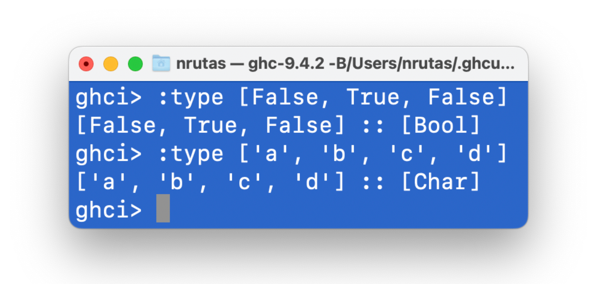
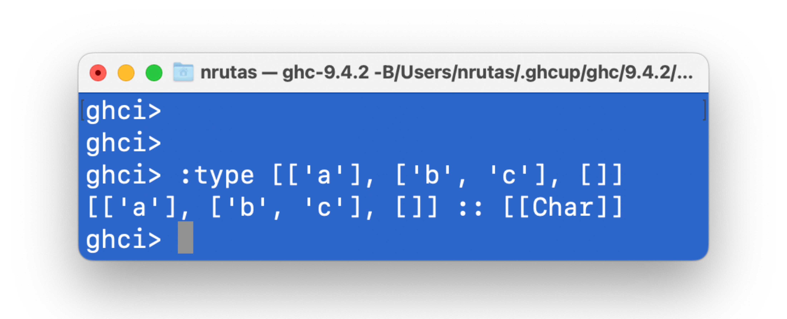
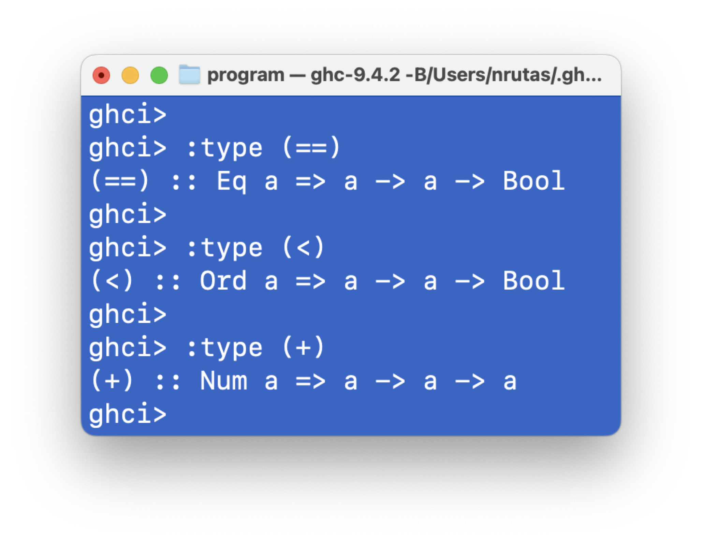

# 第 04 章：类型与类簇

> 中英文对照：
> - 类型 => `Type`
> - 类簇 => `Type Class`

> **小和尚：**
> - 为什么不把 “Type Class” 翻译为 **“类型类”** 呢？
>
> **唐僧：**
> - 这是一件鸡毛蒜皮的事情；甚至后面很多地方使用的就是 “类型类”
> - 最好的应对方式：**不做任何翻译，直接用原始的英文**
>

### 01 类型

#### 类型是什么

在 Haskell 中，
- 一个类型是由一组值构成的集合

- 例如，`Bool` 类型，包含两个值：`True` `False`

#### 类型错误 (Type Error)

当在应用一个函数时
- 如果：“传入的实际参数” 的类型 与 “函数的形式参数” 的类型 不一致，
- 则称：发生了 **类型错误**


- 在上面这个示例中，

  - `+` 运算符接收的两个参数应该都是数值

  - 实际传给 `+` 运算符的第二个参数 `False` 不是一个数值，而是`Bool`类型的一个值

  - 因此，产生了类型错误

#### 表达式的类型

如果一个表达式 `e` 在评估后会得到类型 `T` 的一个值，则称：`e` 的类型为 `T`

- 在 Haskell 程序中写作：`e :: T`

任何一个良构的表达式 (Well-formed Expression) 都具有一个确定的类型

- 表达式的类型在编译时刻即能够自动被确定

- 确定表达式的类型的过程，称为 **类型推导** (Type Inference)

  ```shell
      f :: A -> B, e :: A
    -----------------------[app]
           f e :: B
  ```
  上面是类型论中非常经典的一条推导规则；含义如下：

  - 如果：表达式 `f` 的类型为 `A -> B`，且 表达式 `e` 的类型为 `A`

  - 那么：表达式 `f e` 的类型为 `B`

- 所有的类型错误在编译时刻都会被发现

  - 因此，无需在运行时刻进行类型错误的检查，从而提高了程序运行的安全型和效率

在 `GHCi` 中，使用命令 `:type` 可以确定一个表达式的类型 (无需评估这个表达式的值)

<p><center>
    
</center></p>


### 02 Haskell 中的基础数据类型

#### `Bool`

该类型具有两个逻辑值：`True` `False`

- exported by Prelude (即：该类型是 `Prelude` 模块的输出元素之一)

> 前面已经介绍：`Prelude` 输出的所有元素都会被自动导入到任何模块中
>
> - 因此，在程序中可以直接使用 `Prelude` 输出的元素

#### `Char`

该类型的每一个值，对应 Unicode 字符编码规范中的一个字符 (code point)

- 关于 Unicode 字符的更多信息请参看 [http://www.unicode.org/](http://www.unicode.org/)

- exported by Prelude

#### `String`

该类型在 Haskll 中的定义：`type String = [Char]`

- 即，一个字符串是一个由 `Char` 类型的值形成的 `List`

- exported by Prelude

#### `Int`

一种定长的整数类型

- 在 GHC 编译器中，该类型能够表达的整数范围是 `[-2^63, 2^63 - 1]`

- exported by Prelude

#### `Integer`

一种不定长的整数类型

- 因此，可以表达任何一个整数值

- exported by Prelude

#### `Word`

一种定长的无符号整数类型

- 与 `Int` 具有相同的长度

- exported by Prelude

#### `Natural`

一种不定长的无符号整数类型

- 因此，可以表达任何一个自然数

- exported by `Numeric.Natural` in the `base` package

#### `Float` / `Double`

单/双精度浮点数类型 (exported by Prelude)

<p><center>
    
</center></p>

### 03 List 类型

一个 list 是由若干个相同类型的值形成的序列。

<p><center>
    
</center></p>

给定一个类型 `T`，`[T]`是一个类型

- `[T]`的每一个值，都是一个元素类型为`T`的 list

**重要信息：**

- `[T]`类型没有对 list 的长度信息 (即，list 中元素的数量) 进行任何限制

  - 因此，包含 `1` 个 `T` 元素的 list、包含 `0` 个 `T` 元素的 list、以及包含 `3` 个 `T` 元素的 list，它们的类型都是 `[T]`

- 任何一个类型`T`，都具有一个对应的 `[T]` 类型

  - 因此，`[[T]]` 也是一个合法的类型

<p><center>
    
</center></p>

### 04 Tuple 类型

给定两个类型 `X` 和 `Y`：

- `(X, Y)` 是一个二元组 (2-tuple) 类型

  - 该类型的任何一个值具有形式 `(x, y)`，满足：`x :: X` 且 `y :: Y`

  - 在集合论中，类型 `(X, Y)` 就是两个集合 `X` 和 `Y` 的笛卡尔积

给定三个类型 `X` `Y` `Z`：

- `(X, Y, Z)` 是一个三元组 (3-tuple) 类型

  - 该类型的任何一个值具有形式 `(x, y, z)`，满足：`x :: X`、`y :: Y` 且 `z :: Y`

类似地，还有 4-tuple、5-tuple、...

**重要信息：**

1. Haskell 中 **不存在** 一元组 (1-tuple) 类型

2. Haskell 中 **存在** 零元组 (0-tuple) 类型

   - 零元组类型，写作 `()`

   - 零元组类型具有唯一一个值，写作 `()`

   > **小和尚：**
   >
   > - 零元组类型 和 唯一的零元组值 在形式上都是`()`；这不会产生混乱吗？
   >
   > **唐僧：**
   >
   > - 你的观察很仔细，非常棒 👍
   >
   > - 不用担心，在 Haskell 中，类型和值具有截然不同的上下文
   >
   >   - 因此，从`()`的上下文能够判定 “它到底是类型还是值”

3. 三元组和更多元组，**在理论上**，没有存在的必要 (在实践中，为了使用上的方便，有存在的必要)

   - 原因：基于二元组，可以构造出三元组、四元组、...

   - 例如：`(1, (2, 3))` 是一个采用二元组表示的三元组


### 05 Function 类型

给定两个类型 `X` 和 `Y`：

- `X -> Y` 是一个函数类型

  - 该类型的每一个值都是一个函数，且该函数把类型 `X` 的值映射到类型 `Y` 的值

**重要信息：**

- 任何类型都可以作为类型 `X -> Y` 中的 `X` 和 `Y`

  例如：List 类型 和 Tuple 类型都可以作为 `X` 和 `Y`

  ```haskell
  add :: (Int, Int) -> Int
  add (x, y) = x + y
  ```

  ```haskell
  zeroto :: Int -> [Int]
  zeroto n = [0..n]

  -- 这里有一个细节的语法
  -- [0..n] 表示一个 list，其中依次包含从 0 到 n 的所有整数值
  ```

#### 05.01 柯里化函数 (Curried functions)

> **小和尚：**
> - **“柯里化”** (Curried) 这个奇怪的名字来源于哪里呢？
>
> **唐僧：**
> - 如果这么说，那么 “Haskell” 这个奇怪的名字又来源于哪里呢？


> 希望很多年以后，你的 “姓” 或 “名” 也能出现在教科书中。

<br>

给定一个函数 `f :: A -> B`

- 如果：`A` 是一个二元组类型，

- 那么：我们可以通过柯里化，把 `f` 转换为一个等价的但第一个参数不再是元组类型的函数

- 例如，上面出现的函数 `add :: (Int, Int) -> Int`，它对应的柯里化函数为：

  ```haskell
  add :: Int -> Int -> Int
  add x y = x + y
  ```

类似地，如果函数的第一个参数是`n`元组类型，我们也可以通过柯里化把第一个参数拆解开。例如：

```haskell
mult :: (Int, Int, Int) -> Int

-- 柯里化版本
mult :: Int -> Int -> Int -> Int
```

<br>

Haskell 的 `Prelude` 模块中定义了两个函数：

```haskell
curry :: ((a, b) -> c) -> a -> b -> c
curry f x y = f (x, y)
```

```haskell
uncurry :: (a -> b -> c) -> ((a, b) -> c)
uncurry f p = f (fst p) (snd p)
```
- 这两个函数支持在 “非柯里化函数” 和 “柯里化函数” 之间相互转换

  - 把类型中出现的 `a` `b` `c`，理解为任意类型即可

<br>

与非柯里化函数相比，柯里化函数具有更好的灵活性：

- 应用 非柯里化函数 时，需要一次提供全部的参数

- 应用 柯里化函数 时，可以按需传入参数

  - 例如，对于上面引入的`mult`函数，如下应用方式都是合法的：

    - `mult 2`，`mult 2 3`，`mult 2 3 4`

<br>

关于柯里化函数的一个语法约定 (Conversion)

- 运算符 `->` 满足右结合律

  - 例如：`Int -> Int -> Int -> Int` 等价于 `Int -> (Int -> (Int -> Int))`

### 06 多态函数 (Polymorphic Functions)

> 称一个函数为 **多态函数**，
> - 如果它的类型中包含一或多个 **类型变量** (type variable)

例如，如下是一个多态函数：

```haskells
len :: [a] -> Natural
len [] = 0
len (n:ns) = 1 + len ns
```
- 在 Haskell 中，类型声明中 “以小写字符开头” 的标识符，被编译器视为一个 **类型变量**

- `len` 的类型的含义：

  - 对于任意类型 `a`，`len` 函数接收一个 `[a]` 类型的值，返回一个自然数

- 在实际应用 `len` 函数的时候，编译器会根据传入的参数的类型，推导出 `a` 的具体类型

#### `Prelude` 模块中的若干多态函数

```haskell
fst :: (a, b) -> a
fst (x, _) = x
```
- 获得二元组中第一个分量

```haskell
snd :: (a, b) -> b
snd (_, y) = y
```
- 获得二元组中第二个分量

```haskell
head :: [a] -> a
head (x:_) = x
```
- 获得一个 list 中的第一个元素

- 注意：`head` 是一个 partial function，因为它在 “长度为零的 list” 上没有定义

```haskell
tail :: [a] -> [a]
tail (_:xs) = xs
```
- 获得一个 list 中删除第一个元素后的 list；仍然是一个 partial function

```haskell
last :: [a] -> a
last [x]    = x
last (_:xs) = last xs
```
- 获得一个 list 中的最后一个元素；仍然是一个 partial function

#### 重载函数 (Overloaded Functions)

> 称一个多态函数为 **重载函数**
> - 如果它的类型中包含一或多个 **类型类约束** (type class constraint)

例如，如果你在 ghci 中输入命令 `:type (+)`，就会看到 `(+)` 的类型
```shell
ghci> :type (+)
(+) :: Num a => a -> a -> a
```
- 在这个类型中，`=>` 左侧的东西，称为 **类型类约束**

- 这个约束的含义是：适用于 `(+)` 的类型 `a` 必须是类型类 `Num` 的一个实例


上面这个截图表明：

- `(+)` 适用于 **“整数”** 和 **“浮点数”**，但是不适用于 **“字符”**

- 原因：类型 `Char` 不是类型类 `Num` 的实例

### 07 类型类 (Type Class)

`Prelude` 模块输出了很多类型类，其中最基础的三个是：
- `Eq` `Ord` `Num`

 这三个类型类出现在了很多函数中：


 <p><center>
    
</center></p>

上面的截图表明：

1. 相等关系运算符 `==` 适用于所有实现了 `Eq` 的类型

2. 小于关系运算符 `<` 适用于所有实现了 `Ord` 的类型

3. 加法运算符 `+` 适用于所有实现了 `Num` 的类型

#### 07.01 `Eq`

类型类 `Eq` 的定义如下：

```haskell
class Eq a where
     (==), (/=) :: a -> a -> Bool
     x /= y     = not (x == y)
     x == y     = not (x /= y)
```
- 对任意类型 `a`，

  - 如果：它想要成为类型类 `Eq` 实例

  - 那么：它必须要实现 `==` 和 `/=` 这两个运算符 (两者的类型均为 `a -> a -> Bool`)

- 在上面的定义中，

  - `==` 和 `/=` 的缺省实现已经给出；但是，这是一种循环定义

  - 因此，在将类型 `a` 声明为 `Eq` 的实例时，至少要对 `==` 和 `/=` 两者之一给出定义

- `Prelude` 输出的所有基本数据类型都是 `Eq` 的实例

- 如果：一个组合类型中包含的每一个类型都是 `Eq` 的实例，\
  那么：编译器可以将这个组合类型自动实现为 `Eq` 的实例。

> Haskell 规范没有对实现 `Eq` 的类型应该满足的性质给出任何规定
>
> 在数学的意义上，如果类型 `T` 实现了 `Eq` (即，`T` 是 `Eq` 的实例)，则应满足如下性质：
>
> 1. 自反性 (Reflexivity)
>    - 对于类型为 `T` 的任何一个表达式 `x`，满足：`x == x` === `True`
>
> 2. 对称性 (Symmetry)
>    - 对于类型为 `T` 的任何两个表达式 `x` `y`，满足：`x == y` === `y == x`
>
> 3. 传递性 (Transitivity)
>    - 对于类型为 `T` 的任何三个表达式 `x` `y` `z`，满足：
>      - 如果：`(x == y) && (y == z)` === `True`
>      - 那么：`x == z` === True
>
> 4. 外延性 (Extensionality)
>    - 对于任何函数 `f :: X -> T`，以及类型为 `X` 的两个表达式 `a` `b`，满足：
>    - 如果：`a == b` === `True`
>    - 那么：`f a == f b` === `True`
>
> 5. Negation
>    - 对于类型为 `T` 的任何两个表达式 `x` `y`，满足：
>      - `x /= y` === `not (x == y)`

> Eq 的最小完整实现：`(==) | (/=)`
> - 如果：你想将类型 `T` 声明为 `Eq` 的一个实例，
> - 那么：你可以仅提供 `==` 和 `/=` 两者之一在 `T` 上的实现

#### 07.02 `Ord`

类型类 `Ord` 的定义依赖于另外一个类型：

```haskell
data Ordering  =  LT | EQ | GT
```
- `data` 是 Haskell 的一个关键字 (Key Word)，用于声明一个类型

  > **小和尚：**
  > - 声明类型的关键字为什么不是 `type`
  >
  > **唐僧：**
  >
  > - 在 Haskell 中，关键字 `type` 被用来声明类型的别名
  >   - “类型的别名”：就是给一个类型赋予另外一个名字
  >     - 这样，一个类型就同时有两个名字了
  >
  > - 我个人认为：`type` 的这种功能，是一个设计决策上的错误
  >

- 这个类型定义，用 “第二章：初见函数式思维” 中的那种语言，可以表述为如下形式：

  ```haskell
  def Ordering : Type = {
      ctor LT : Self,
      ctor EQ : Self,
      ctor GT : Self,
  }
  ```
- 这个类型定义，用人类语言描述，就是：

  - `Ordering` 这个类型具有三个值 `LT` `EQ` `GT`

    - 类似于：`Bool` 这个类型具有两个值 `True` `False`

<br>

类型类 `Ord` 的定义如下：

```haskell
class  (Eq a) => Ord a  where
    compare              :: a -> a -> Ordering
    (<), (<=), (>), (>=) :: a -> a -> Bool
    max, min             :: a -> a -> a

    compare x y  =  if x == y then EQ
               else if x <= y then LT
               else GT

    x <  y = case compare x y of { LT -> True;  _ -> False }
    x <= y = case compare x y of { GT -> False; _ -> True }
    x >  y = case compare x y of { GT -> True;  _ -> False }
    x >= y = case compare x y of { LT -> False; _ -> True }

    max x y = if x <= y then y else x
    min x y = if x <= y then x else y
```
这个定义看起来有点复杂，让我们仔细捋一捋：

```haskell
class  (Eq a) => Ord a  where -- 这行代码含义如下：
```
1. 声明了一个类型类 `Ord`

2. 声明了一个类型类约束 `Eq a`，含义如下：
   - 对于任何一个类型 `a`
     - 如果：`a` 想要成为 `Ord` 的实例
     - 那么：`a` 必须首先成为 `Eq` 的实例

```haskell
compare              :: a -> a -> Ordering
(<), (<=), (>), (>=) :: a -> a -> Bool
max, min             :: a -> a -> a        -- 这三行代码含义如下：
```
- 对于任何类型 `a`
  - 如果：`a` 想要成为 `Ord` 的实例，
  - 那么：`a` 就必须实现上面声明的所有 7 个函数/运算符

```haskell
-- 其余的代码，给出了所有待实现的函数/运算符的缺省实现；不再赘述
```

<br>

`Ord` 定义了一种 **全序** (Total Order) 关系，因此，满足如下性质：

1. 可比性 (Comparability)

   - `x <= y` || `y <= x` === `True`

2. 传递性 (Transitivity)

   - 如果：`x <= y` && `y <= z`  ===  `True`
   - 那么：`x <= z`  ===  `True`

3. 自反性 (Reflexivity)

   - `x <= x`   ===   `True`

4. 反对称性 (Antisymmetry)

   - 如果：`x <= y` && `y <= x`  ===  `True`
   - 那么：`x == y`  ===  `True`

<br>

同时，Haskell 规范 **希望**：`Ord` 的任何实现，应保持下述性质成立：

1. `x >= y`  ===  `y <= x`
2. `x < y`   ===  `x <= y` && `x /= y`
3. `x > y`   ===  `y < x`
4. `x < y`   ===  `compare x y == LT`
5. `x > y`   ===  `compare x y == GT`
6. `x == y`  ===  `compare x y == EQ`
7. `(min x y) == (if x <= y then x else y)`   ===   `True`
8. `(max x y) == (if x >= y then x else y)`   ===   `True`

> `Ord` 的最小完整实现：`compare | (<=)`
> - 如果：你想将类型 `T` 声明为 `Ord` 的一个实例，
> - 那么：你可以仅提供 `compare` 和 `<=` 两者之一在 `T` 上的实现


#### 07.03 `Num`

类型类 `Num` 的定义如下：

```haskell
class  Num a  where
    (+), (-), (*) :: a -> a -> a

    negate :: a -> a             -- Unary negation

    abs :: a -> a                -- Absolute value

    signum :: a -> a             -- Sign of a number

    fromInteger :: Integer -> a  -- Conversion from an Integer

    x - y    = x + negate y
    negate x = 0 - x

```

> Haskell 规范没有对实现 `Num` 的类型应该满足的性质给出任何规定
>
> 在数学的意义上，如果类型 `T` 实现了 `Num` (即，`T` 是 `Num` 的实例)，则应满足如下性质：
>
> 1. `+` 满足结合律 (Associativity)
>    - `(x + y) + z` === `x + (y + z)`
>
> 2. `+` 满足交换律 (Commutativity)
>    - `x + y` === `y + x`
>
> 3. `fromInteger 0` 是 `+` 的单位元
>    - `x + fromInteger 0` === `x`
>
> 4. `negate` 是 `+` 的逆元
>    - `x + negate x` ===  `fromInteger 0`
>
> 5. `*` 满足结合律
>    - `(x * y) * z` === `x * (y * z)`
>
> 6. `fromInteger 1` 是 `*` 的单位元
>    - `x * fromInteger 1` === `x`
>    - `fromInteger 1 * x` === `x`
>
> 7. `*` 对 `+` 的分配律 (Distributivity)
>    - a * (b + c)  ===  (a * b) + (a * c)
>    - (b + c) * a  ===  (b * a) + (c * a)

> `Num` 的最小完整实现：
> - `(+)`, `(*)`, `abs`, `signum`, `fromInteger`, `(negate | (-))`\
>   也即：
>   - 前 5 个必须给出实现；`negate` 和 `(-)` 两者之一给出实现

## 本章作业

> <div class="warning">
>
> **作业 01**
>
> 请写出如下表达式的类型：
>
> - ```['a', 'b', 'c']```
>
> - ```('a', 'b', 'c')```
>
> - ```[(False, '0'), (True, '1')]```
>
> - ```([False, True], ['0', '1'])```
>
> - ```[tail, init, reverse]```
>   - 说明：`tail` `init` `reverse` 是 `Prelude` 模块输出的三个元素
>
> </div>

> <div class="warning">
>
> **作业 02**
>
> 请写出如下函数的类型：
>
> - ```second xs = head (tail xs)```
>
> - ```swap (x, y) = (y, x)```
>
> - ```pair x y = (x, y)```
>
> - ```double x = x * 2```
>
> - ```palindrome xs = reverse xs == xs```
>
> - ```twice f x = f (f x)```
>
> </div>

> <div class="warning">
>
> **作业 03**
>
> 阅读教科书，用例子 (在`ghci`上运行) 展示：
>
> - `Int`与`Integer`的区别，以及
>
> - `show`和`read`的用法。
>
> </div>

> <div class="warning">
>
> **作业 04**
>
> 阅读教科书和 `Prelude` 模块文档
>
> - 理解 `Integral` 和 `Fractional` 这两个 Type Class 中定义的函数和运算符
>
> - 用例子 (在`ghci`中运行) 展示每一个函数/运算符的用法
>
> </div>
