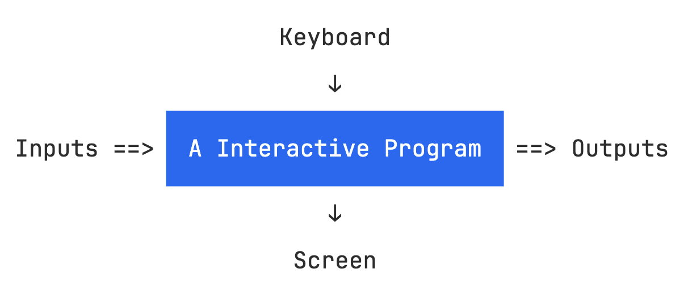

# 第 11 章：交互式程序设计

### 01 交互式程序

到目前为止，我们接触到的绝大多数 Haskell 程序都可以归为 **批处理程序** (Batch Program)。

批处理程序是这样一种程序：

- 它在开始时接收一组参数，然后在结束时返回一个值

  - 在执行过程中 (即，开始与结束之间)，该程序无法接收外部的参数，也不会向外界输出信息

<p><center>
    
</center></p>

<br>

与批处理程序相对的，是 **交互式程序** (Interactive Program)：这类程序在执行过程中能够从键盘读入信息，并向屏幕输出信息。

<p><center>
    
</center></p>

<br>

令人遗憾的是，在 Haskell 中编写交互式程序，是一件相对困难的事情。

- Haskell 程序在本质上是数学意义上的 **纯函数** (Pure Function)。

  - 从来没有一本数学书或一位数学家说：一个函数可以与键盘或屏幕这种世俗的东西发生交互

  - 也即，数学中的函数没有 **副作用** (Side Effects)：即，不会对世界的状态产生直接的改变

- 但是，交互式程序具有副作用：即，从键盘读入信息、向屏幕输出信息

<br>

但是，一件 **非常搞笑** 的事情是：

- 只要把我们的思维方式稍微调整一下，Haskell 无法处理交互式程序的问题就迎刃而解了

<br>

任何一个交互式程序都可以为被视为一个纯函数：

- 该函数的输入参数：世界的当前状态 (The current state of the world)

- 该函数的输出参数：改变后的世界 (A modified world)

```haskell
type IO = WORLD -> WORLD
```

<br>

为了将计算结果进行显式化，可以对上述类型定义进行轻微调整：

```haskell
type IO a = WORLD -> (a, WORLD)
```

<br>

因此，Haskell 中的交互式程序，具有 `IO a` 这种类型：

- 称这种类型的一个值，是一个返回一个 `a` 类型值的 **动作** (Action)

> **唐僧：**
> - 你不会真的以为，`IO a` 把整个世界的状态读入程序吧？
>
> **小和尚：**
> - 如果你不说，我们还真这样认为呢 (看，我们多天真🐯)


### 02 Prelude 模块提供的若干 IO 动作

```haskell
getChar :: IO Char
```
该动作具有如下行为：

- 读入用户通过键盘输入的一个字符

- 将这个字符输出到屏幕上

- 将这个字符作为返回值

<br>

```haskell
putChar :: Char -> IO ()
```
该函数具有如下行为：

- 接收一个字符 `c` 作为输入参数

- 返回一个动作：该动作向屏幕输出字符 `c`，并返回一个零元组 `()`

<br>

```haskell
return :: a -> IO a
```
该函数具有如下行为：

- 接收一个 `a` 类型的参数 `x`

- 返回一个动作：该动作不产生任何副作用，直接返回 `x`

> 注意：千万不要把这个 `return` 函数与其他语言中的 `return` 关键字混淆了

<br>

> Haskell 提供了一个关键字 `do`，用于表达 “顺序执行若干动作”。
>
> 例如：
>
> ```haskell
> act :: IO (Char, Char)
> act = do x <- getChar
>          getChar
>          y <- getChar
>          return (x, y)
> ```
> - 首先注意到，这个动作的类型是 `IO (Char, Char)`
>   - 也即，在执行完动作后，会返回一个类型为 `(Char, Char)` 的值
>
> - `do` 后面顺序放置了 4 个 动作
>
>   1. `x <- getChar`
>
>      - 执行动作 `getChar`，并把返回的那个 `Char` 值赋到变量 `x` 上
>
>      - 注意：
>        - `getChar` 的类型是 `IO Char`
>
>        - 因此，`x = getChar` 这种方式无法把 `IO Char` 中的 `Char` 赋给 `x`
>
>      - 这里的 `<-`，就是 List Comprehension 中的 Generator 中的 `<-`
>        - 更多细节，在后文中讲解
>
>   2. `getChar`
>      - 执行 `getChar` 这个动作，且忽略其返回值
>
>   3. `y <- getChar`
>      - 执行动作 `getChar`，并把返回的那个 `Char` 值赋到变量 `x` 上
>
>   4. `return (x, y)`
>      - `return` 的类型：`a -> IO a`

<br>

从键盘读入一行字符串：

```haskell
getLine :: IO String
getLine = do x <- getChar
             if x == '\n' then
                 return []
             else
                 do xs <- getLine
                    return (x:xs)
```

<br>

向屏幕输出一个字符串：

```haskell
putStr :: String -> IO ()
putStr []     = return ()
putStr (x:xs) = do putChar x
                   putStr xs
```

<br>

向屏幕输出一个字符串，并换行：

```haskell
putStrLn :: String -> IO ()
putStrLn xs = do putStr xs
                 putChar '\n'
```

#### 一个简单的交互式程序

```haskell
strlen :: IO ()
strlen = do putStr "Enter a string: "
            xs <- getLine
            putStr "The string has "
            putStr (show (length xs))
            putStrLn " characters"
```
```shell
ghci> strlen
Enter a string: Haskell
The string has 7 characters
```

### 03 示例：Hangman 游戏

 游戏规则：

 - 玩家一：在键盘上秘密地输入一个单词 `secret`

 - 玩家二：尝试去推理出这个单词。推理过程如下：

   1. 玩家二在键盘上输入一个猜测的单词 `guess`

   2. 计算机点亮 `secret` 中那些出现在 `guess` 中的字母

   3. 玩家二跳转到第 1 步，进行新一轮的猜测，直到猜中

```haskell
ghci> hangman
Think of a word:
-------
Try to guess it:
? pascal
-as--ll
? rust
--s----
? haspell
has-ell
? haskell
You got it!
```

<br>

下面，我们采用自顶向下的策略实现这个游戏。

<br>

首先给出最顶层的函数：

```haskell
hangman :: IO ()
hangman = do
    putStrLn "Think of a word: "
    word <- sgetLine  -- get a string secretly
    putStrLn "Try to guess it:"
    play word  -- play the game

```

其中，动作 `sgetLine` 的行为：

- 从键盘上读入一行字符串 `secret`

- 将其中的每一字母以字符 `-` 输出到屏幕

```haskell
sgetLine :: IO String
sgetLine = do
     x <- getCh -- get a char without echoing
     if x == '\n' then
         do putChar x
            return []
     else
         do putChar '-'
            xs <- sgetLine
            return (x:xs)
```

其中，动作 `getCh` 的行为：
- 从键盘读入一个字符，但是不把这个字符输出到屏幕

```haskell
import System.IO (hSetEcho, stdin)

getCh :: IO Char
getCh = do
    hSetEcho stdin False
    x <- getChar
    hSetEcho stdin True
    return x
```
- 这里有一些底层的实现细节，可以不用太关注

<br>

函数 `play` 是游戏的主体：支持玩家二不断进行猜测，并输出系统的反馈。

```haskell
play :: String -> IO ()
play word = do
     putStr "? "
     guess <- getLine
     if guess == word then
         putStrLn "You got it!"
     else
      do putStrLn (match word guess)
         play word

match :: String -> String -> String
match xs ys = [if elem x ys then x else '-' | x <- xs]
```

### 04 示例：Nim 游戏

游戏规则：

- 一个棋盘，初始状态如下：

  ```shell
  1: * * * * *
  2: * * * *
  3: * * *
  4: * *
  5: *
  ```

- 两个玩家轮流对棋盘进行如下操作：

  - 选择一行，并从这一行的尾部删除一或多个 `*`

- 清空棋盘的玩家是游戏的赢家

<br>

下面，我们采用自底向上的策略实现这个游戏。

<br>

棋盘的表示和显示：

```haskell
type Board = [Int]

initial :: Board
initial = [5,4,3,2,1]

finished :: Board -> Bool
finished = all (== 0)
```
```haskell
putBoard :: Board -> IO ()
putBoard [a, b, c, d, e] = do
    putRow 1 a
    putRow 2 b
    putRow 3 c
    putRow 4 d
    putRow 5 e

putRow :: Int -> Int -> IO ()
putRow row num = do
    putStr $ show row
    putStr ": "
    putStrLn $ concat $ replicate num "* "
```

```shell
ghci> putBoard initial
1: * * * * *
2: * * * *
3: * * *
4: * *
5: *
```

<br>

游戏中的一次操作：从一行的尾部删除一或多个 `*`

```haskell
-- 判断一次操作是否合法
valid :: Board -> Int -> Int -> Bool
valid board row del = board !! (row - 1) >= del

-- (!!) :: [a] -> Int -> a
-- List index (subscript) operator, starting from 0
-- (exported by Prelude)
```

```haskell
-- 进行一次操作
move :: Board -> Int -> Int -> Board
move board row del = [ update r n | (r,n) <- zip [1..] board ]
  where
    update r n = if r == row then n - del else n
```

<br>

游戏主函数：

```haskell
nim :: IO
nim = play initial 1

play :: Board -> Int -> IO ()
play board player =
   do newline
      putBoard board
      newline
      if finished board then
         do putStr "Player "
            putStr $ show $ next player
            putStrLn " wins!!"
      else
         do putStr "Player "
            putStrLn $ show player
            row <- getDigit "Enter a row number: "
            del <- getDigit "Stars to remove: "
            if valid board row del then
               play (move board row del) (next player)
            else
               do newline
                  putStrLn "ERROR: Invalid move"
                  play board player
```

## 本章作业

> <div class="warning">
>
> **作业 01**
>
> 定义一个动作 `adder :: IO ()`，它具有如下行为：
> 1. 从键盘读入一个正整数 `n`
> 2. 从键盘读入 `n` 个整数 (每个整数一行)，然后输出这 `n` 个整数的和
>
> 例如：
> ```shell
> ghci> adder
> How many numbers? 5
> 1
> 3
> 5
> 7
> 9
> The total is 25
> ```
>
> </div>


> <div class="warning">
>
> **作业 01**
>
> 下载本章介绍的两个游戏的源代码，仔细阅读，并玩耍一下
> - 下载链接：<http://www.cs.nott.ac.uk/~pszgmh/pih.html>
