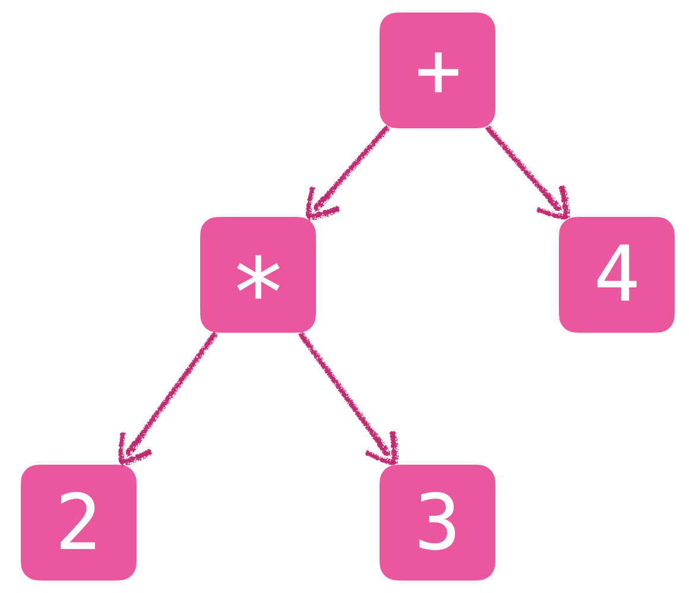

# 第 13 章：Monadic Parser

<br>

#### 01 什么是解析器 (Parser) ？

解析器是一个程序：它接收一段文本信息 (即，一个字符串)，对其进行分析，确定其语法结构 (Syntactic Structure)

例如，对于字符串 `2 * 3 + 4`，一个特定的解析器可能会把它理解为如下的树形结构：

<p><center>
    
</center></p>

<br>

#### 02 在哪里会用到解析器 ？

目前看来，任何一种程序设计语言，它的工具链中大概都会存在一个解析器。

举例而言：

- 你在 ghci 中输入的字符串 (Haskell 程序/表达式)，需要经过一个解析器进行分析后，才会进行后续处理

- 你在 终端 (Terminal) 中输入的命令 (也是一种程序)，也是如此

- 在浏览器中打开一个页面，本质上是打开一个使用 HTML 语言编写的程序，将这个程序解析为一棵 DOM (Document Object Model) 树，然后再把这棵树渲染在浏览器窗口中

- 你现在正在浏览的这个页面，它的本质是一个使用 markdown 语法撰写的程序；这个程序在被解析后被转换为 HTML 程序，然后再被浏览器解析和渲染，然后才被你看到

<br>

#### 03 将解析器建模为函数

```haskell
type Parser = String -> Tree
```
- 解析器是一个函数：它接收一个字符串，返回一种树形结构

> 一般情况下，解析器的输出是一棵树，称为 **抽象语法树** (Abstract Syntax Tree / AST)

<br>

在更一般的情况下，我们需要表示 “部分解析”：
- 即，只解析了输入字符串的一个前缀 (余下的部分仍然是一个字符串)

```haskell
type Parser = String -> (Tree, String)
```
- 解析器的返回值是一个二元组 `(Tree, String)`

  - 已被解析的部分被表示为一棵树

  - 未被解析的部分仍然保持字符串的形态

<br>

在更为复杂的情况下，可能会解析失败，也可能存在多种不同的解析方式：

```haskell
type Parser = String -> [(Tree, String)]
```
- 解析器的返回值是一个序列 `[(Tree, String)]`

  - 当解析失败时，返回序列的长度为 `0`

  - 当只存在一种解析方式时，返回序列的长度为 `1`

  - 当存在 `n` 种解析方式时，返回序列的长度为 `n`

<br>

然后，我们可以将解析器的输出泛化为任何一种类型：

```haskell
type Parser a = String -> [(a, String)]
```
- 在本章中，我们只考虑解析器的返回序列长度为 `0` 或 `1` 这两种情况

<br>

最后，为了能够将 `Parser` 声明为 `Monad` 的实例，对 `Parser` 进行如下定义：

```haskell
newtype Parser a = P (String -> [(a,String)])
```

顺便定义一个 `app` 函数，将一个解析器作用到一个程序上：

```haskell
app :: Parser a -> String -> [(a,String)]
app (P f) = f
```

<br>

下面，我们就来实现各种各样的解析器。

<br>

#### 04 The `item` Parser

```haskell
item :: Parser Char
item  = P $ \program -> case program of
                []     -> []
                (x:xs) -> [(x, xs)]
```

> `item` parser 仅从程序中取出第一个字符

```haskell
ghci> app item ""
[]

ghci> app item "abc"
[('a',"bc")]
```

<br>

#### 05 将 Parser 声明为 Monad 的实例

```haskell
instance Functor Parser where

 -- fmap :: (a -> b) -> Parser a -> Parser b
    fmap g p = P $ \program -> case app p program of
                       []         -> []  -- 遇到失败，则传播/返回失败
                       [(v, out)] -> [(g v, out)]
```

```haskell
ghci> app (toUpper <$> item) "abc"
[('A',"bc")]

ghci> app (toUpper <$> item) ""
[]
```

<br>

```haskell
instance Applicative Parser where

 -- pure :: a -> Parser a
    pure v = P $ \program -> [(v,program)]

 -- <*> :: Parser (a -> b) -> Parser a -> Parser b
    pg <*> px = P $ \program -> case app pg program of
                    []         -> []  -- 遇到失败，则传播/返回失败
                    [(g, out)] -> app (g <$> px) out
```

```haskell
ghci> app (pure 1) "abc"
[(1,"abc")]

ghci> three = g <$> item <*> item <*> item where g x y z = (x,z)
ghci> app three "abcdef"
[(('a','c'),"def")]
```

<br>

```haskell
instance Monad Parser where

 -- (>>=) :: Parser a -> (a -> Parser b) -> Parser b
    p >>= f = P $ \program -> case app p program of
                      []         -> []
                      [(v, out)] -> app (f v) out
```

```haskell
ghci> app (return 1) "abc"
[(1,"abc")]

ghci> three = do { x <- item; item; z <- item; return (x, z) }
ghci> app three "abcdef"
[((‘a','c'),"def")]
```

<br>

#### 06 选择 (Choice)

在模块 `Control.Applicative` 中定义了一个类簇：

```haskell
-- A monoid on applicative functors.
class Applicative f => Alternative f where

    -- An associative binary operation
    -- 一个满足结合律的二元运算符
    (<|>) :: f a -> f a -> f a

    -- The identity of '<|>'
    -- 二元运算符 '<|>' 的单位元
    empty :: f a

    -- Zero or more.
    many :: f a -> f [a]
    many v = some v <|> pure []

    -- One or more.
    some :: f a -> f [a]
    some v = (:) <$> v <*> many v
```
- `<|>` 满足结合律

  ```haskell
  x <|> (y <|> z) === (x <|> y) <|> z
  ```

- `empty` 是 `<|>` 的单位元

  ```haskell
  empty <|> x === x
  ```
  ```haskell
  x <|> empty === x
  ```

<br>

**将 `Maybe` 声明为 `Alternative` 的实例**

```haskell
instance Alternative Maybe where

 -- empty :: Maybe a
    empty = Nothing

 -- (<|>) :: Maybe a -> Maybe a -> Maybe a
    Nothing <|> r = r  -- 若第一个选择为空，则返回第二个选择
    l       <|> _ = l  -- 若第一个选择非空，则返回第一个选择

 -- 以下代码无需书写；放在这里，只为方便阅读和理解

 -- Zero or more.
    many :: Maybe a -> Maybe [a]
    many v = some v <|> pure []
    --                  ^^^^^^^
    --                  === Just []
    --       如果 some v 为 Nothing，则返回 Just []；表示 zero 次
    --       否则，返回 some v；表示 more 次

 -- One or more.
    some :: Maybe a -> Maybe [a]
    some v = (:) <$> v <*> many v
    -- 若 v 为 Nothing，则返回 Nothing
```

```haskell
ghci> import Control.Applicative

ghci> some Nothing
Nothing

ghci> many Nothing
Just []
```
<br>

**将 `Parser` 声明为 `Alternative` 的实例**

```haskell
instance Alternative Parser where

 -- empty :: Parser a
    empty = P $ \program -> []
    -- 一个直接返回失败的解析器

 -- (<|>) :: Parser a -> Parser a -> Parser a
    p <|> q = P $ \program -> case app p program of
                      []  -> app q program
                      rst -> rst
    -- 对于输入的程序，首先用 p 进行解析：
       -- 如果解析失败，则用 q 进行解析，并返回解析的结果
       -- 否则，返回用 p 进行解析的结果
    --
    -- 简而言之，p <|> q 的效果是：
       -- 如果一个程序用 p 能够成功解析，则 p <|> q === p
       -- 否则，p <|> q === q
    --
    -- 这样，就实现了一种顺序尝试的效果：
       -- 即，顺序尝试若干解析方式
          -- 遇到第一个成功的解析方式，则返回该解析结果
          -- 否则，返回最后一种解析方式的结果 (无论成功或失败)

 -- 以下代码无需书写；放在这里，只为方便阅读和理解

 -- Zero or more.
    many :: Parser a -> Parser [a]
    many v = some v <|> pure []
    --                  ^^^^^^^
    --                  === P $ \program -> [([],program)]
    --
    -- 对输入的程序尽可能多地连续使用 v 进行解析
       -- 若一次都没有成功，则不进行任何解析

 -- One or more.
    some :: Parser a -> Parser [a]
    some v = (:) <$> v <*> many v
    -- 首先，对输入的程序使用 v 进行一次解析
       -- 若发生失败，则返回/传播失败
    -- 然后，再对余下未被解析的程序 使用 many v 进行解析
```

```haskell
ghci> app empty "abc"
[]

ghci> app (item <|> return 'd') "abc"
[('a',"bc")]

ghci> app (empty <|> return 'd') "abc"
[('d',"abc")]
```

<br>

#### 07 若干基础解析器

```haskell
sat :: (Char -> Bool) -> Parser Char
sat p = do
    x <- item
    if p x then return x else empty

-- 或者
sat p = item >>= \x -> if p x then return x else empty
```
- `sat p` 把两个动作组合在一起

  - 首先，解析出程序中的第一个字符 `x`

  - 然后，如果 `x` 满足谓词 `p`，

    - 则返回 `x` 以及余下未被解析的程序

    - 否则，返回失败

<br>

```haskell
-- 数字字符解析器
digit :: Parser Char
digit  = sat isDigit

-- 小写字母解析器
lower :: Parser Char
lower = sat isLower

-- 大写字母解析器
upper :: Parser Char
upper = sat isUpper

-- 字母解析器
letter :: Parser Char
letter = sat isAlpha

-- 字母或数字解析器
alphanum :: Parser Char
alphanum = sat isAlphaNum

-- 指定字符解析器
char  :: Char -> Parser Char
char x = sat (x ==)
```

> **课堂练习：**
>
> 定义一个解析器：
>
> ```haskell
> string :: String -> Parser String
> ```
>
> 分析输入的程序是否具有一个制定的前缀。
>
> `string` 的行为示例如下：
>
> ```haskell
> ghci> app (string "abc") "abcdef"
> [("abc","def")]
>
> ghci> app (string "abc") "ab1234"
> []
>
> ghci> app (string "") "ab1234"
> [("","ab1234")]
> ```
>
> ```rust
> string :: String -> Parser String
> # string [] = return []
> # string (x:xs) = do
> #     char x
> #     string xs
> #     return (x:xs)
> ```

<br>

#### 08 The `ident` Parser / 标识符解析器

我们将一个标识符 (identifier) 定义为满足如下条件的字符串：

1. 字符串的首字符必须是一个小写英文字母

2. 除首字符之外的其他字符，或者是英文字母，或者是数字

```haskell
ident :: Parser String
ident = do
    x  <- lower
    xs <- many alphanum
    return (x:xs)
```

```haskell
ghci> app ident "abc def"
[("abc"," def")]

ghci> app ident "12 def"
[]
```

<br>

#### 09 The `nat` Parser / 自然数解析器

```haskell
nat :: Parser Int
nat = do
    xs <- some digit
    return (read xs)
```

```haskell
ghci> app nat "123abc"
[(123,"abc")]

ghci> app nat "abc123"
[]
```

<br>

#### 10 The `space` Parser / 空格字符解析器

```haskell
space :: Parser ()
space = do
    many (sat isSpace)
    return ()
```

```haskell
ghci> app space "   abc"
[((),"abc")]
```

<br>

#### 11 The `int` Parser / 整数解析器

```haskell
int :: Parser Int
int = do char '-'
         n <- nat
         return $ - n
      <|> nat
```

```haskell
ghci> app int "123abc"
[(123,"abc")]

ghci> app int "-123abc"
[(-123,"abc")]
ghci> app int "abc123"
[]
```

<br>

#### 12 在解析过程中，去除首尾空格

```haskell
token :: Parser a -> Parser a
token p = do
    space
    v <- p
    space
    return v
```

```haskell
identifier :: Parser String
identifier = token ident

natural :: Parser Int
natural = token nat

integer :: Parser Int
integer = token int

symbol :: String -> Parser String
symbol xs = token $ string xs
```

<br>

#### 13 The `nats` Parser

```haskell
nats :: Parser [Int]
nats = do
    symbol "["
    n <- natural
    ns <- many $ do {symbol ","; natural}
    symbol "]"
    return (n:ns)
```

```haskell
ghci> app nats "[1, 2, 3 ]"
[([1,2,3],"")]

ghci> app nats "[1, 2, 3, ]"
[]
```

#### 14 算术运算表达式的解析与评估

考虑满足如下条件的表达式：

1. 仅包含 `个位数`、`+`、`*`、以及用于优先级控制的圆括号对 `(` `)`

2. `+` 和 `*` 满足右结合律

3. `*` 的优先级高于 `+`

<br>

这种表达式可以使用如下的 **上下文无关文法** (Context-Free Grammar) 进行描述

```rust
expr   ::= term '+' expr | term
// 一个 expr,
// - 或者是：一个 term 后跟一个字符 '+'，然后再跟一个 expr
// - 或者是：一个 term
//
// 其中：
// - 用单引号包围的字符，称为 终结字符 (即，出现在程序中的固定字符)
// - 字符 | 是一种表示 “或” 的结构
//
// 上面这一条文法，也可以紧凑地表示为如下形式
expr   ::= term ('+' expr | ε) // 其中，ε 表示 “空”

term   ::= factor '*' term | factor
// 类似地，上面这条文法也可写为如下紧凑形式
term   ::= factor ('*' term | ε)

factor ::= digit | '(' expr ')'

digit  ::= '0' | '1' | ... | '9'
```

下面，我们就把上面的文法依次翻译到对应的解析器上。

<br>

```rust
expr ::= term ('+' expr | ε)
```
```haskell
expr :: Parser Int
expr  = do t <- term
           do   symbol "+"
                e <- expr
                return (t + e)
            <|> return t
```

<br>

```rust
term ::= factor ('*' term | ε)
```
```haskell
term :: Parser Int
term  = do f <- factor
           do   symbol "*"
                t <- term
                return (f * t)
            <|> return f
```

<br>

```rust
factor ::= digit | '(' expr ')'
```
```haskell
factor :: Parser Int
factor  = do   symbol "("
               e <- expr
               symbol ")"
               return e
           <|> natural
```

<br>

最后，定义评估函数：

```haskell
eval :: String -> Int
eval xs = fst $ head $ app expr xs
```

下面是使用示例：

```haskell
ghci> eval "2 * ( 3 + 4 )"
14

ghci> eval "2 * 3 + 4"
10
```

## 本章作业

> <div class="warning">
>
> **作业 01**
>
> 对本章介绍的算术表达式解析器进行扩展，支持 `减 (-)` 和 `除 (/)` 两种运算。
>
> 具体而言，根据如下两条更新后的文法，对解析器的实现进行相应地修改：
> ```rust
> expr ::= term ('+' expr | '-' expr | ε)
>
> term ::= factor ('*' term | '/' term | ε)
> ```
> </div>
